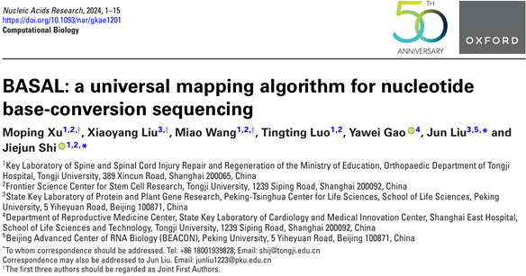

We developed a universal mapping algorithm for both RNA and DNA modification sequencing - **BASAL**, which is recently published on [*Nucleic Acids Research*, Dec 2024](https://doi.org/10.1093/nar/gkae1201). Congratulations to Moping, Miao, and Tingting!
