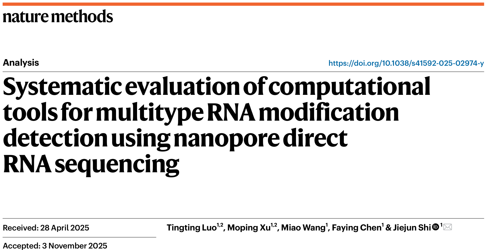

We have developed a benchmark platform for algorithms that detect RNA modifications using third-generation sequencing, **NaRMBench**, which is recently published on [*Nature Methods*, Dec 2025](https://www.nature.com/articles/s41592-025-02974-y) and provides guidelines for detecting various modifications.
Congratulations to Tingting, Moping, Miao, and Faying!
