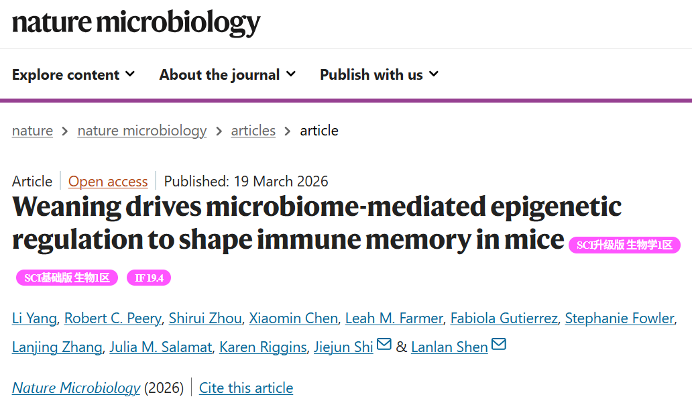

Working with Lanlan's group, we uncovered how weaning-associated microbiota and epigenetic remodeling jointly establish intestinal immune memory.([*Nature Microbiology*, March 2026](https://www.nature.com/articles/s41564-026-02295-6)).
