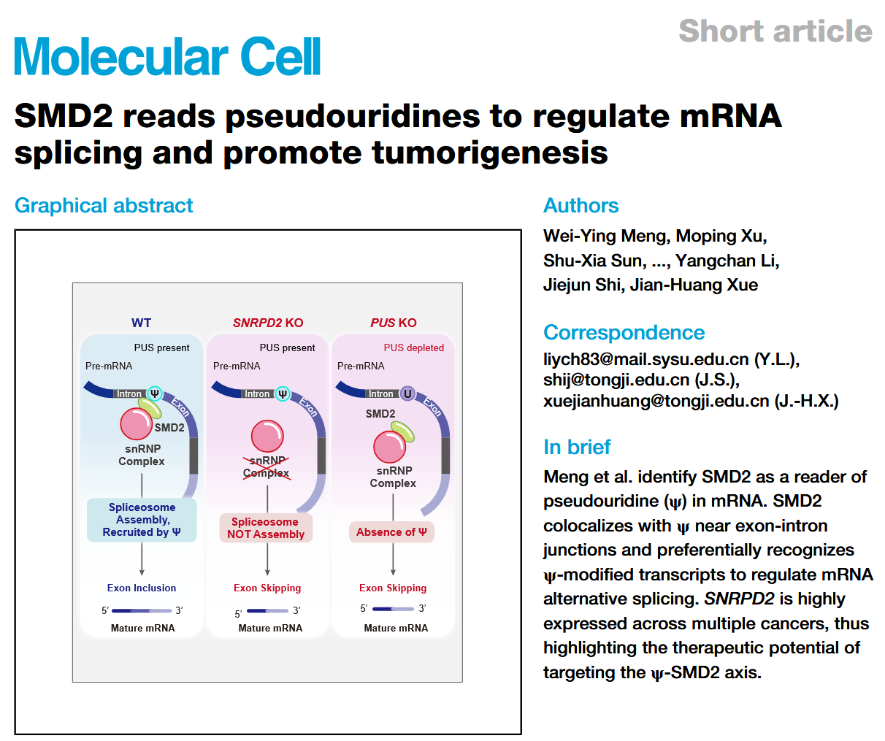

Working with Jianhuang's group, we uncovered a new reader of pseudouridine(ψ), SMD2, which recognizes ψ-modified transcripts to regulate mRNA splicing.([*Molecular Cell*, July 2026](https://doi.org/10.1016/j.molcel.2026.06.033)).

Congratulations to Moping and all collaborators!

